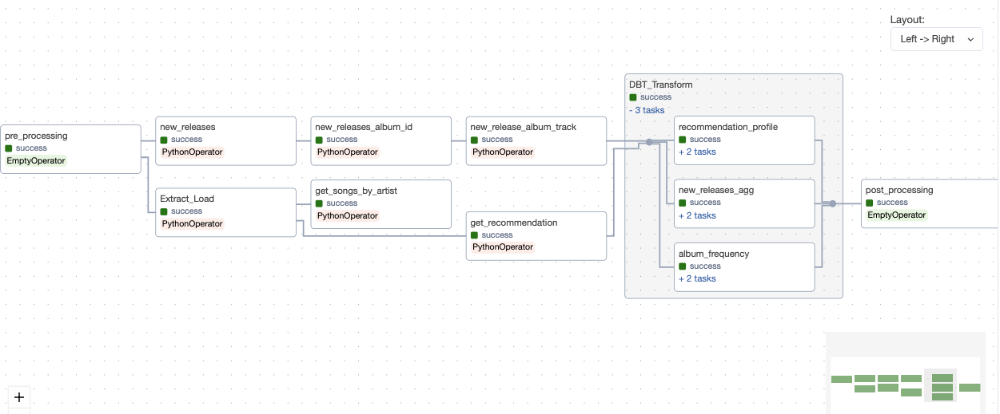

# spotify_etl
 
This project is to develop the ETL pipeline for Spotify API. Demonstrating the concept of end-to-end solution for analytics use case. 
It requires to extract the sources from [Spotify Developer](https://developer.spotify.com/) through the endpoints of the APIs.
In this case, it comes with Airflow as orchestration tool to properly manage each stage of the workflow and also helps to monitor the processing.  
Ensuring its quality and completeness all the way loaded to the SnowFlake database.  
DBT comes into place as transformation tool once the datasets are loaded to snowflake database.  

Spotify API End points in this project: 
- [Search for Item](https://developer.spotify.com/documentation/web-api/reference/search) 
- [Get Artist's Top Tracks](https://developer.spotify.com/documentation/web-api/reference/get-an-artists-top-tracks) 
- [Get Album Tracks](https://developer.spotify.com/documentation/web-api/reference/get-an-albums-tracks) 
- [Get Recommendations](https://developer.spotify.com/documentation/web-api/reference/get-recommendations) 
The following chart illustrates each task in the DAG starts from extracting Spotify data, uploading to Snowflake and running transformation by dbt. 

