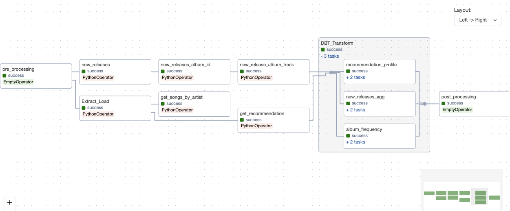

# spotify_etl
 
This project is working on ETL pipeline with Airflow as orchestration tool to demonstrate the usabiliy of Spotify API.  
DBT comes into place as transformation tool when the datasets are loaded to snowflake database.  

